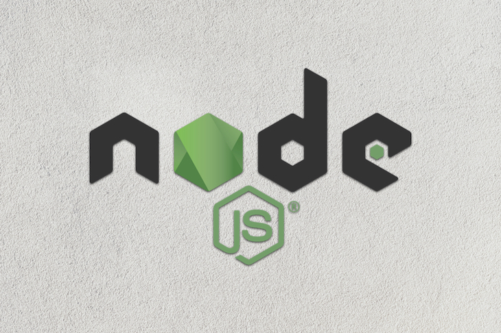
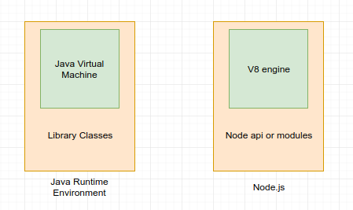

> Node.js® is a JavaScript runtime built on [Chrome's V8 JavaScript engine](https://v8.dev/).

Right up until 2009, javascript was written and executed only in the browser. Used for event handlers, 
data validation and sanitization, a little data persistence (local storage) and basically user interface. 


So much more can be done with javascript. Node.js is a JavaScript runtime environment
which includes everything you need to execute a javascript program as a standalone. Both your browser 
JavaScript and Node.js run on the V8 JavaScript runtime engine. This engine takes your JavaScript code and converts it into a 
faster machine code. Machine code is low-level code which the computer can run without needing to first interpret it.


With the help of node modules, some global and some which can be installed from the node package manager, 
[NPM](https://npmjs.com), which is the largest ecosystem of open source libraries in the world, javascript code, which coming 
from a java background can be compared to library classes, are made available for development and production. 
NPM being open source also means anyone can contribute to the ecosystem and that is what makes it the largest of its kind.



This is a quick post to show you how to setup a simple HTTP web server on your local machine using NodeJS. 
The web server runs on the [express module](https://expressjs.com), a simple zero-configuration http server for serving data to the browser. 

___

## Prerequisites

[Nodejs](https://nodejs.org/en/download) runtime installed.

___

## Let's get started

Create your project directory and in the root of your directory, type and execute this command on your terminal

```bash

npm init -y

```
This command is a step-by-step tool to scaffold out your project. It will prompt you for input for a few aspects of the project in the following order:

* The project's name
* The project's initial version
* The project's description
* The project's entry point (meaning the project's main file)
* The project's test command (to trigger testing with something like Moccha)
* The project's git repository (where the project source can be found)
* The project's keywords (basically, tags related to the project)
* The project's license (this defaults to ISC - most open-source Node.js projects are MIT)

The -y flag says yes to all the prompts and saves everything into a package.json file.

Install express with this line in anywhere in your project

```bash

npm install express --save

```

This would add express to your projects dependencies and make it an available module to import in other files. A node-modules directory would be created automatically and would house all packages you install with npm. NPM caches packages too, which is very great! So if you do not have internet connection but have installed a package before, trust NPM to still make that package available to your node-modules folder.

Next, create an index.js file in the root of your directory and input the following code

```js
//index.js
 const express = require('express')
 const app = express()
 const port = 3000
 app.get('/', (req,res)=>{
  res.send("Hello World")
 })
 app.listen(port, ()=>{
  console.log('Server is running on port'+ port)
 })
```

Now in your terminal, run in the root of your project

```bash
node index.js
```
Navigate to [localhost/3000](http://127.0.0.1/3000) in your browser to view the string "hello world" served in your browser.


### Want to learn more?
You can read more about the docs on [Nodejs](https://nodejs.org/) and [Express](https://expressjs.com) on these links and navigate to their Documentation sections 
or "API reference pages.